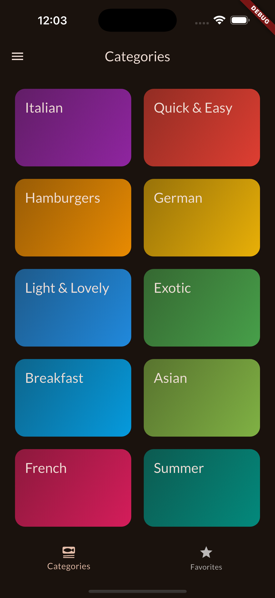
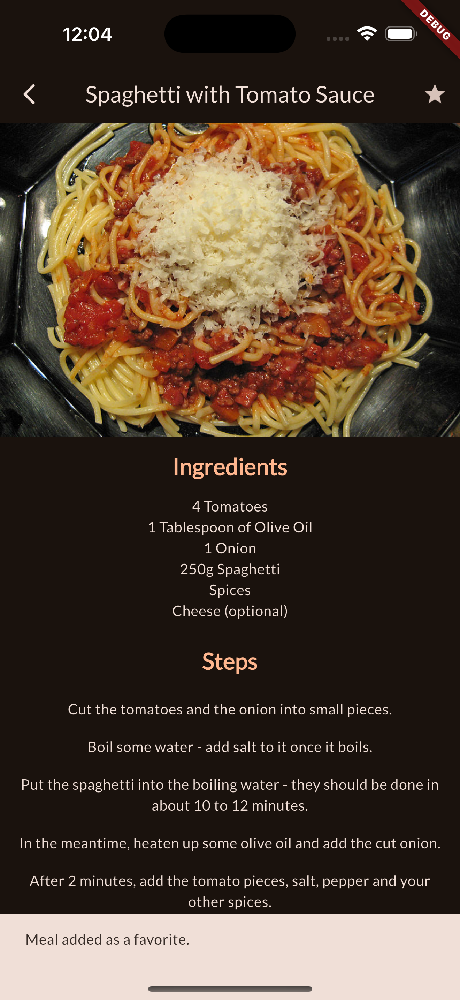
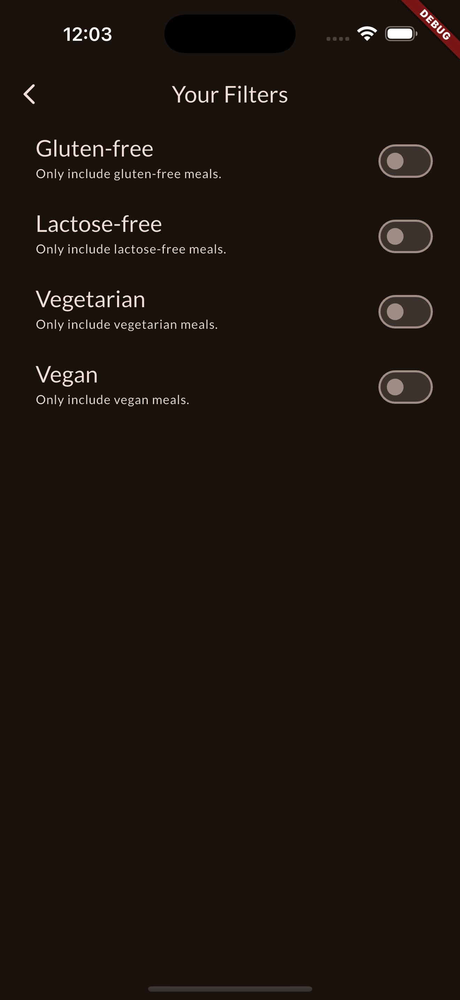

# 🍽️ Meals App

[](https://flutter.dev/)
[](https://dart.dev/)
[](LICENSE)

---

## 📖 About The Project

**Meals App** is a Flutter mobile application that allows users to browse a variety of ready-made meal recipes.  
It features beautiful images, simple animations, and filters to sort meals by type such as vegetarian and more, making it easy and enjoyable to discover your next favorite dish.

---

## 🚀 Features

- 📸 High-quality meal images.
- ✨ Smooth and simple animations.
- 🔍 Filters to browse meals by categories like vegetarian, vegan, etc.
- 📚 Ready-made meal recipes for easy browsing.

---

## 🛠️ Built With

| Technology  | Description                     |
|-------------|---------------------------------|
|   | UI toolkit for building natively compiled apps |
|       | Programming language used                      |

---

## 📸 Screenshots

### Home Screen


### Meal Details Screen



### Filters Screen


---

## ⚙️ Installation & Setup

1. Make sure you have [Flutter](https://flutter.dev/docs/get-started/install) installed.
2. Clone the repo:
   ```bash
   git clone https://github.com/yourusername/meals_app.git
3.	Navigate to the project directory:
    cd meals_app
4.	Get the dependencies:
    flutter pub get
5.	Run the app:
    flutter run

🤝 Contributing

Contributions are welcome! Please open an issue or submit a pull request.

⸻

📄 License

Distributed under the MIT License. See LICENSE for more information.

⸻

📫 Contact

Created by fares salah
Feel free to reach out via [LinkedIn](https://eg.linkedin.com/in/fares-salah-86a751354)
